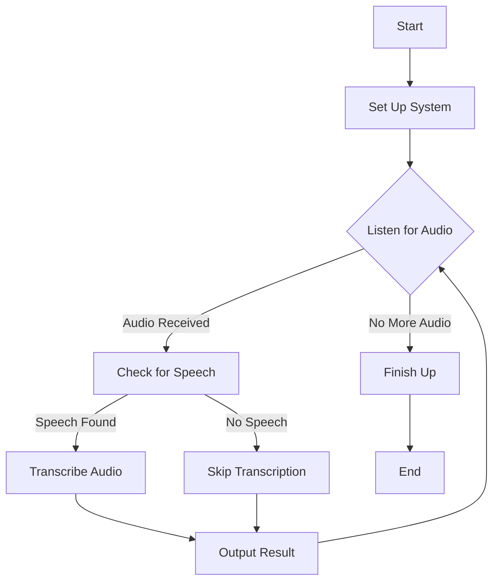
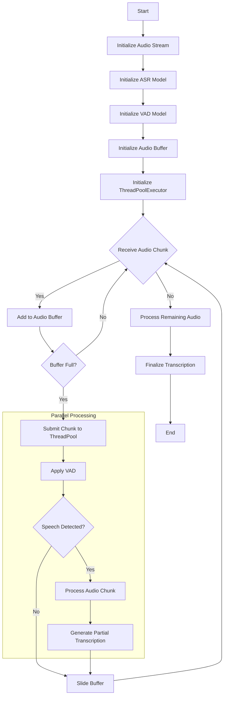

# Chinese/Taiwanese Whisper ASR Project

An advanced Automatic Speech Recognition (ASR) system for Chinese (Traditional) and Taiwanese, leveraging the power of OpenAI's Whisper model. This project supports full fine-tuning, Parameter-Efficient Fine-Tuning (PEFT), and streaming inference, optimized for T4 GPUs.

## 🌟 Features

- 🎙️ Fine-tuning of Whisper models on Chinese/Taiwanese data
- 🚀 PEFT methods support (e.g., LoRA) for efficient fine-tuning
- 🔄 Batch and streaming inference capabilities
- 🖥️ User-friendly Gradio web interface
- ⚡ Optimized performance on T4 GPUs

## 📁 Project Structure

```
ChineseTaiwaneseWhisper/
├── scripts/
│   ├── gradio_interface.py
│   ├── infer.py
│   └── train.py
├── src/
│   ├── config/
│   ├── crawler/
│   ├── data/
│   ├── models/
│   ├── trainers/
│   └── inference/
├── tests/
├── requirements.txt
├── setup.py
└── README.md
```

## 🛠️ Installation

1. Clone the repository:
   ```bash
   git clone https://github.com/sandy1990418/ChineseTaiwaneseWhisper.git
   cd ChineseTaiwaneseWhisper
   ```

2. Set up a virtual environment:
   ```bash
   python -m venv venv
   source venv/bin/activate  # On Windows, use `venv\Scripts\activate`
   ```

3. Install dependencies:
   ```bash
   pip install -r requirements.txt
   ```

## 🚀 Usage

### Training

#### Standard Fine-tuning
```bash
python scripts/train.py --model_name_or_path "openai/whisper-small" \
                        --language "chinese" \
                        --dataset "common_voice_13_train" \
                        --dataset_dir "./youtube_data" \
                        --output_dir "./whisper-finetuned-zh-tw" \
                        --num_train_epochs 3 \
                        --per_device_train_batch_size 16 \
                        --learning_rate 1e-5 \
                        --fp16 \
                        --timestamp False
```

#### PEFT Fine-tuning (e.g., LoRA)
```bash
python scripts/train.py --model_name_or_path "openai/whisper-small" \
                        --language "chinese" \
                        --use_peft \
                        --peft_method "lora" \
                        --dataset "common_voice_13_train, YOUR_CUSTOM_DATASET"  \
                        --output_dir "Checkpoint_Path" \
                        --num_train_epochs 10  \
                        --per_device_train_batch_size 4 \
                        --learning_rate 1e-5  \
                        --fp16\
                        --timestamp True
```

#### Training Arguments

| Argument | Description | Default |
|----------|-------------|---------|
| `--model_name_or_path` | Path or name of the pre-trained model | Required |
| `--language` | Language for fine-tuning (e.g., "chinese", "taiwanese") | Required |
| `--dataset` | Name of the dataset to use | Required |
| `--dataset_dir` | The name of the folder containing datasets. |
| `--output_dir` | Directory to save the fine-tuned model | Required |
| `--num_train_epochs` | Number of training epochs | 3 |
| `--per_device_train_batch_size` | Batch size per GPU/CPU for training | 16 |
| `--learning_rate` | Initial learning rate | 3e-5 |
| `--fp16` | Use mixed precision training | False |
| `--use_timestamps` | Include timestamp information in training | False |
| `--use_peft` | Use Parameter-Efficient Fine-Tuning | False |
| `--peft_method` | PEFT method to use (e.g., "lora") | None |

### Inference

#### Gradio Interface
Launch the interactive web interface:
```bash
python scripts/gradio_interface.py
```
Access the interface at `http://127.0.0.1:7860` (default URL).

> **Note**: For streaming mode, use Chrome instead of Safari to avoid CPU memory issues.

#### Batch Inference
```bash
python scripts/infer.py --model_path openai/whisper-small \
                        --audio_files audio.wav \
                        --mode batch \
                        --use_timestamps False
```

#### Inference Arguments

| Argument | Description | Default |
|----------|-------------|---------|
| `--model_path` | Path to the fine-tuned model | Required |
| `--audio_files` | Path(s) to audio file(s) for transcription | Required |
| `--mode` | Inference mode ("batch" or "stream") | "batch" |
| `--use_timestamps` | Include timestamps in transcription | False |
| `--device` | Device to use for inference (e.g., "cuda", "cpu") | "cuda" if available, else "cpu" |
| `--output_dir` | Directory to save transcription results | "output" |
| `--use_peft` | Use PEFT model for inference | False |
| `--language` | Language of the audio (e.g., "chinese", "taiwanese") | "chinese" |

### Audio Crawler

Collect YouTube data:
```bash
python src/crawler/youtube_crawler.py \
       --playlist_urls "YOUTUBE_PLAYLIST_URL" \
       --output_dir ./youtube_data \
       --dataset_name youtube_asr_dataset \
       --file_prefix language_prefix
```

#### Crawler Arguments

| Argument | Description | Default |
|----------|-------------|---------|
| `--playlist_urls` | YouTube playlist URL(s) to crawl | Required |
| `--output_dir` | Directory to save audio files and dataset | "./output" |
| `--dataset_name` | Name of the output dataset file | "youtube_dataset" |
| `--file_prefix` | Prefix for audio and subtitle files | "youtube" |

## 🔧 Customization

- 📊 Use different datasets by modifying the `dataset_name` parameter
- 🛠️ Adjust PEFT methods via `peft_method` and configurations in `src/config/train_config.py`
- 🔬 Optimize inference by modifying `ChineseTaiwaneseASRInference` in `src/inference/flexible_inference.py`


## 🧪 Testing

Run tests with pytest:
```bash
pytest tests/
```

For detailed output:
```bash
pytest -v tests/
```

Check test coverage:
```bash
pip install pytest-cov
pytest --cov=src tests/
```

## 💻 Performance Optimization

### Baseline Performance

On a T4 GPU, without any acceleration methods:
- Inference speed: 1:24 (1 minute of processing time can transcribe 24 minutes of audio)

This baseline gives you an idea of the default performance. Depending on your specific needs, you may want to optimize further or use acceleration techniques.

### Optimization Techniques

To address memory issues or improve performance on T4 GPUs:

1. 📉 Reduce batch size (`--per_device_train_batch_size`)
   - Decreases memory usage but may increase processing time
2. 🔽 Use a smaller Whisper model (e.g., "openai/whisper-tiny")
   - Faster inference but potentially lower accuracy
3. 📈 Increase gradient accumulation steps (`--gradient_accumulation_steps`)
   - Simulates larger batch sizes without increasing memory usage
4. 🔀 Enable mixed precision training (`--fp16`)
   - Speeds up computation and reduces memory usage with minimal impact on accuracy

### Advanced Optimization

For further performance improvements:

5. 🚀 Use PEFT methods like LoRA
   - Significantly reduces memory usage and training time
6. ⚡ Implement quantization (e.g., int8)
   - Dramatically reduces model size and increases inference speed
7. 🖥️ Utilize multi-GPU setups if available
   - Distributes computation for faster processing

> Note: The actual performance may vary depending on your specific hardware, audio complexity, and chosen optimization techniques. Always benchmark your specific use case.
## 🔄 Streaming ASR Flow
#### Real-time Audio Simple Transcription Pipeline
1. Set Up: We prepare our system to listen and transcribe.
2. Listen: We constantly listen for incoming audio.
3. Check: When we get audio, we check if it contains speech.
4. Process:
   - If there's speech, we transcribe it.
   - If not, we skip that part.
5. Share: We immediately share what we found, whether it's words or silence.
6. Repeat: We keep doing this until there's no more audio.
7. Finish: When the audio ends, we wrap everything up and provide the final transcript.



#### Real-time Audio Transcription Pipeline


<br>

## 📊 Dataset Format

The Chinese/Taiwanese Whisper ASR project uses a specific format for its datasets to ensure compatibility with the training and inference scripts. The format can include or exclude timestamps, depending on the configuration.

### Basic Structure

Each item in the dataset represents an audio file and its corresponding transcription:

```python
{
    "audio": {
        "path": "path/to/audio/file.wav",
        "sampling_rate": 16000
    },
    "sentence": "The transcription of the audio in Chinese or Taiwanese.",
    "language": "zh-TW",  # or "zh-CN" for Mandarin, "nan" for Taiwanese, etc.
    "duration": 10.5  # Duration of the audio in seconds
}
```

Use the `dataset_info.json` to determine which dataset you want to use, the structure of `dataset_info.json` is below:
```python
{
    "common_voice_13_train": {
      "hf_hub_url": "mozilla-foundation/common_voice_13_0",
      "columns": {
        "audio": "audio",
        "target": "sentence",
        "language": "chinese"
      },
      "dataset_kwargs": {
        "split": "train"
      },
      "dataset_args": [
        "zh-TW"
      ]
    },
   # If you have a custom dataset that you want to train, please use the following format in the dataset_info.json
   "YOUR_CUSTOM_DATASET": {
      "file_name": "YOUR_CUSTOM_DATASET.json",
      "columns": {
        "audio": "audio_path",
        "target": "timestamp", # change to `sentence` if you want to train a model without timestamp
        "language": "YOUR_DATASET_LANGUEGE"  # please check which languages are be used in Huggingface.
      },
      "dataset_kwargs": {
        "split": "train"
      }
    },
}
```

### Transcription Format Examples

#### Without Timestamps

```
labels:
<|startoftranscript|><|zh|><|transcribe|><|notimestamps|>地圖炮<|endoftext|>
```

In this example:
- `<|startoftranscript|>`: Marks the beginning of the transcription
- `<|zh|>`: Indicates the language (Chinese)
- `<|transcribe|>`: Denotes that this is a transcription task
- `<|notimestamps|>`: Indicates that no timestamps are included
- `地圖炮`: The actual transcription
- `<|endoftext|>`: Marks the end of the transcription

#### With Timestamps

```
labels:
<|startoftranscript|><|zh|><|transcribe|><|0.00|>而對樓市成交抑制作用最大的限購<|6.00|><|endoftext|>
```

In this example:
- `<|startoftranscript|>`, `<|zh|>`, and `<|transcribe|>`: Same as above
- `<|0.00|>`: Timestamp indicating the start of the transcription (0 seconds)
- `而對樓市成交抑制作用最大的限購`: The actual transcription
- `<|6.00|>`: Timestamp indicating the end of the transcription (6 seconds)
- `<|endoftext|>`: Marks the end of the transcription

### Notes

- The choice between using timestamps or not should be consistent throughout your dataset and should match the `use_timestamps` parameter in your training and inference scripts.

### Preparing Your Own Dataset

If you're preparing your own dataset:

1. Organize your audio files and transcriptions.
2. Ensure each transcription includes the appropriate tokens (`<|startoftranscript|>`, `<|zh|>`, etc.).
3. If using timestamps, include them in the format `<|seconds.decimals|>` before each segment of transcription.
4. Use `<|notimestamps|>` if not including timestamp information.
5. Always end the transcription with `<|endoftext|>`.

By following this format, you ensure that your dataset is compatible with the Chinese/Taiwanese Whisper ASR system, allowing for efficient training and accurate inference.

<br>

## 🌐 FastAPI Usage

### 🚀 Launching the API

1. Development Mode:
   ```bash
   fastapi dev api_main.py
   ```

2. Production Mode:
   ```bash
   fastapi run api_main.py
   ```

The API will be accessible at `http://0.0.0.0:8000` by default.

### 🐳 Using Docker

1. Build and start the Docker container:
   ```bash
   bash app/docker.sh
   ```

### 🔍 API Documentation

Access the Swagger UI documentation at `http://localhost:8000/docs` when the server is running.

### 🛠️ Using curl to Interact with the API

1. Health Check:
   ```bash
   curl -k http://localhost:8000/health
   ```

2. Transcribe Audio:
   ```bash
   curl -k -X POST -H "Content-Type: multipart/form-data" -F "file=@/path/to/your/audio/file.wav" http://localhost:8000/transcribe
   ```
   Replace `/path/to/your/audio/file.wav` with the actual path to your audio file.

3. List All Transcriptions:
   ```bash
   curl -k http://localhost:8000/transcriptions
   ```

4. Get a Specific Transcription:
   ```bash
   curl -k http://localhost:8000/transcription/{transcription_id}
   ```
   Replace `{transcription_id}` with the actual UUID of the transcription.

5. Delete a Transcription:
   ```bash
   curl -k -X DELETE http://localhost:8000/transcription/{transcription_id}
   ```
   Replace `{transcription_id}` with the UUID of the transcription you want to delete.


<br>

## 📄 License

This project is licensed under the MIT License. See the [LICENSE](LICENSE) file for details.

<br>

## 🙏 Acknowledgments

- OpenAI for the Whisper model
- Hugging Face for the Transformers library
- Mozilla Common Voice for the dataset